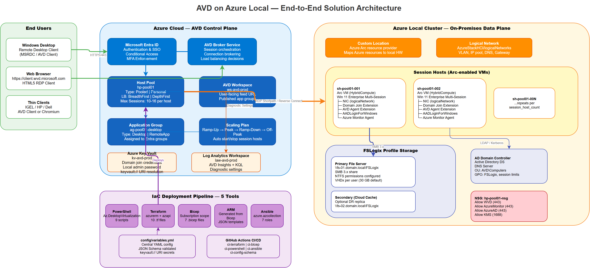

# Architecture Overview

## Solution Summary

This repository provides deployment automation for **Azure Virtual Desktop (AVD)** using **Azure Local** (formerly Azure Stack HCI) as the session-host compute platform.

The AVD architecture has two distinct planes:

- **Control plane** – Hosted in Azure. Includes the host pool, application groups, workspace, and all supporting Azure services (Key Vault, Log Analytics, Storage for FSLogix).
- **Session-host plane** – Hosted on-premises on Azure Local clusters. VMs are created as Arc-enabled virtual machines and registered with the AVD host pool in Azure.

---

## High-Level Architecture



> *Open the [draw.io source](assets/diagrams/avd-solution-architecture.drawio) in draw.io for an editable version.*

The diagram above shows the full end-to-end architecture — End Users connect via HTTPS/RDP Shortpath through the Azure AVD Broker to Session Hosts running on the Azure Local cluster. Supporting services include Entra ID, Key Vault, Log Analytics, FSLogix SMB storage, and the full IaC deployment pipeline.

```
┌─────────────────────────────────────────────────────────────────────┐
│                            AZURE (Cloud)                            │
│                                                                     │
│  ┌──────────────────────────────────────────────────────────────┐  │
│  │                   AVD Control Plane                          │  │
│  │                                                              │  │
│  │   Host Pool ──► Application Group ──► Workspace             │  │
│  │        │                                                     │  │
│  │        └──► Log Analytics Workspace                         │  │
│  │        └──► Key Vault (secrets)                             │  │
│  │        └──► Storage Account (FSLogix / MSIX)                │  │
│  └──────────────────────────────────────────────────────────────┘  │
│                          │                                          │
│              Azure Arc Resource Bridge                              │
└──────────────────────────┼──────────────────────────────────────────┘
                           │
                           │  Arc-enabled AVD Agent Registration
                           ▼
┌──────────────────────────────────────────────────────────────────────┐
│                       Azure Local Cluster                            │
│                                                                      │
│  ┌────────────────────────────────────────────────────────────────┐  │
│  │                   AVD Session Hosts (VMs)                      │  │
│  │                                                                │  │
│  │   VM-1  ──┐                                                   │  │
│  │   VM-2  ──┼──  Windows 11 Multi-Session / Windows Server      │  │
│  │   VM-N  ──┘    AVD Agent + FSLogix Agent                      │  │
│  └────────────────────────────────────────────────────────────────┘  │
│                                                                      │
│  ┌────────────────────────────────────────────────────────────────┐  │
│  │              Scale Out File Server (SOFS)                      │  │
│  │           \\SOFS\Profiles  (SMB share)                         │  │
│  │    (see azurelocal-sofs-fslogix companion repository)         │  │
│  └────────────────────────────────────────────────────────────────┘  │
└──────────────────────────────────────────────────────────────────────┘
           │
           │   On-premises network
           ▼
    ┌──────────────┐
    │  Domain      │
    │  Controllers │
    │  (AD DS)     │
    └──────────────┘
```

---

## Key Components

| Component | Location | Description |
|-----------|----------|-------------|
| **Host Pool** | Azure | Logical grouping of session hosts; defines pooled vs. personal type |
| **Application Group** | Azure | Collection of apps or desktops published to users |
| **Workspace** | Azure | User-facing aggregator for one or more application groups |
| **Log Analytics Workspace** | Azure | Diagnostics, monitoring, and Azure Monitor integration |
| **Key Vault** | Azure | Stores domain-join credentials, registration tokens, and certificates |
| **Storage Account** | Azure | Optional: MSIX app attach packages or cloud-side FSLogix share |
| **Azure Local Cluster** | On-premises | Hyper-converged infrastructure running Storage Spaces Direct |
| **Arc Resource Bridge** | Azure Local | Enables Azure to manage on-premises VMs as Arc-enabled resources |
| **Session Host VMs** | Azure Local | Windows VMs running the AVD Agent and FSLogix Agent |
| **Scaling Plan** | Azure | Autoscaler schedule that powers session host VMs on/off based on demand (Pooled pools) |
| **SOFS / FSLogix** | Azure Local | SMB share providing profile containers (companion repo) |

---

## Identity Options

| Option | Description |
|--------|-------------|
| **Active Directory Domain Services (AD DS)** | Traditional on-premises domain; session hosts domain-joined |
| **AD DS + Entra ID Hybrid Join** (Recommended) | Hybrid join using Entra Connect; supports Conditional Access and SSO via `AADLoginForWindows` extension |

!!! warning "Azure Local Constraint"
    Entra-only join is **NOT supported** on Azure Local. Arc-enabled VMs (`Microsoft.HybridCompute/machines`) do not support Entra-only join. Only AD-Only and Hybrid Join are valid identity strategies.

---

## Network Considerations

- Session hosts require outbound HTTPS (443) to Azure for AVD broker, Entra ID, and Windows Update endpoints.
- RDP traffic from clients terminates at the AVD gateway in Azure; no inbound firewall rules needed on-premises.
- SMB traffic for FSLogix (port 445) between session hosts and SOFS stays on the local network.
- Use a dedicated storage/management VLAN for intra-cluster and SOFS traffic.
- DNS must resolve both Azure endpoints and on-premises names from session-host VMs.

---

## Storage Sizing Guidance

| User Count | FSLogix VHD Size | Recommended SOFS CSV |
|------------|-----------------|----------------------|
| Up to 100  | 30 GB / user    | ~3 TB usable         |
| 100 – 500  | 30 GB / user    | ~15 TB usable        |
| 500+       | 30 GB / user    | Scale horizontally   |

---

## Related Resources

- [AVD on Azure Local overview](https://learn.microsoft.com/en-us/azure/virtual-desktop/azure-local-overview)
- [Azure Local documentation](https://learn.microsoft.com/en-us/azure/azure-local/)
- [FSLogix documentation](https://learn.microsoft.com/en-us/fslogix/)
- [Arc Resource Bridge](https://learn.microsoft.com/en-us/azure/azure-arc/resource-bridge/overview)
- [Companion SOFS/FSLogix repository](https://github.com/AzureLocal/azurelocal-sofs-fslogix)
