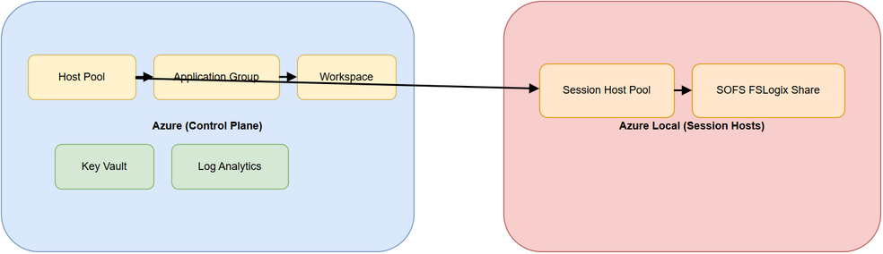
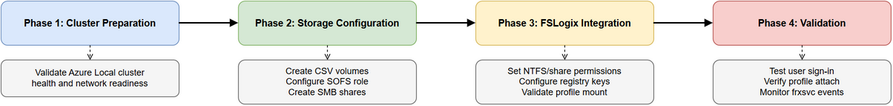

# FSLogix Integration

FSLogix profile containers are the only persistent user state in this architecture. Every other component — session hosts, control plane, networking — can be rebuilt from IaC. Profile containers cannot. This makes FSLogix design, sizing, and DR the most operationally consequential decisions in an Azure Local AVD deployment.

---

## Profile Container Model Selection

!!! tip "Diagram source"
    Draw.io source: `docs/assets/diagrams/avd-fslogix-profile-selection.drawio`. Export → PNG → `docs/assets/images/avd-fslogix-profile-selection.png`.



Two container delivery models are supported. The choice is permanent for a given host pool — switching from VHDX on SOFS to Cloud Cache requires re-mounting every active profile container against the new location, which is a maintenance window operation.

### VHDX on SMB (SOFS) — Recommended Default

The session host mounts the user's profile VHDX directly from the SOFS SMB share using Kerberos authentication. No cloud dependency in steady state — if Azure is unavailable, profiles continue to mount as long as the on-premises SOFS is reachable.

| Characteristic | Detail |
|----------------|--------|
| **Authentication** | Kerberos via AD DS — automatic, no configuration |
| **Write path** | Session host → SMB3 → SOFS CSV volume |
| **Write amplification** | 1× — writes go to one location |
| **Failover** | SOFS guest cluster handles node-level failures automatically |
| **Azure dependency** | None during steady-state profile I/O |
| **Profile locking** | VHDX locked to one session (pooled) or concurrent R/W (personal) |

**Why Kerberos + SOFS is the default:** When a user signs in, `frxsvc.exe` on the session host performs the following sequence:

1. Resolve the SOFS access point (`\\sofs-access-point\fslogixprofiles`) via DNS
2. Obtain a Kerberos TGS ticket for the SOFS computer account using the user's existing AD session
3. Open an SMB3 session to the SOFS share
4. Locate or create the user's profile directory (`%username%_%sid%` or `%sid%_%username%` with FlipFlop enabled)
5. Attach the VHDX and mount it as the user's profile root

All 5 steps use credentials already in the user's Kerberos token — no storage keys, no SAS tokens, no additional auth flows. If any step fails, FSLogix falls back to a local temporary profile and logs event IDs in `Microsoft-FSLogix-Apps/Operational`. The user gets a blank desktop. This is the failure mode to monitor for.

**Use VHDX on SOFS when:** you have an on-premises AD DS domain (or hybrid Entra ID), the SOFS guest cluster is deployed, and your primary concern is operational simplicity and predictable performance.

---

### Cloud Cache (CCDLocations) — DR and Entra-only Scenarios

Cloud Cache replaces `VHDLocations` with `CCDLocations`. FSLogix maintains a local read/write cache on the session host's OS disk and asynchronously flushes writes to all configured cloud providers (Azure Files, Azure Blob).

!!! warning "2–3× write amplification"
    Every profile write is written to the local cache AND flushed to every CCDLocations provider before sign-out completes. During logon storms, flush latency accumulates. Monitor the `CCDWriteBehindDelay` registry value and set it conservatively (default: 1000 ms). If flush does not complete before sign-out, you risk cache/cloud divergence.

| Characteristic | Detail |
|----------------|--------|
| **Authentication** | Azure Files: Kerberos via Entra Kerberos or storage account key; Blob: SAS or managed identity |
| **Write path** | Session host local cache → async flush to each CCDLocations provider |
| **Write amplification** | 2–3× (local + all providers) |
| **Failover** | If a cloud provider is unreachable, reads serve from local cache; sign-out flush retries |
| **Azure dependency** | Requires reachable Azure storage endpoint at sign-out |
| **SOFS dependency** | None — eliminates on-premises profile storage entirely |

**CCDLocations registry value format (Azure Files example):**

```
type=smb,connectionString=\\<storage-account>.file.core.windows.net\<share>;
type=smb,connectionString=\\<dr-storage-account>.file.core.windows.net\<share>
```

Multiple providers are separated by `;`. Profile reads are served from the first healthy provider in the list.

**Use Cloud Cache only when:** there is no on-premises AD DS, or you need active-active multi-site profile redundancy and have accepted the write amplification cost.

---

### Container Model Decision Matrix

| Factor | VHDX on SOFS | Cloud Cache |
|--------|-------------|-------------|
| On-premises AD DS available | ✅ (Recommended) | ✅ (Unnecessary complexity) |
| Entra-only session hosts | ❌ (Kerberos requires AD) | ✅ Required |
| Multi-site profile DR | ⚠ (Needs SOFS replication) | ✅ Built-in |
| Steady-state write performance | ✅ 1× amplification | ⚠ 2–3× amplification |
| Azure network outage tolerance | ✅ No impact | ⚠ Sign-out flush fails |
| Operational complexity | ✅ Low | ⚠ High |

---

## Sizing and Capacity Planning

### Profile Size by User Type

Profile size depends on what applications write to the profile and whether Office cache is included (ODFC container separates this). Start with the baselines below and measure growth after 30 days in production.

| User Type | Base Profile Size | With ODFC Container | Notes |
|-----------|-----------------|--------------------|---------|
| Light (web, email, Teams-light) | 10–15 GB | 5–10 GB ODFC | Outlook cache dominates if not using ODFC |
| Knowledge worker (Outlook, Teams, Office) | 20–30 GB | 10–20 GB ODFC | OST file is the largest single item |
| Power user (dev, data, thick client apps) | 30–50 GB | 15–30 GB ODFC | AppData and `%LOCALAPPDATA%` grow rapidly |

**Recommendation:** deploy a separate ODFC (Office Data File Container) to separate Outlook OST and Teams cache from the main profile container. This reduces main profile size by 30–50% and prevents Office cache growth from filling the profile volume.

### Required Capacity Formula

$$
Required\ Capacity = (Users \times Profile\ Size) \times 1.4
$$

The 1.4× multiplier accounts for:
- 30% free space buffer (required — VHDX dynamic expansion needs headroom)
- 10% metadata and SOFS overhead

**Examples:**

| User Count | Profile Size | Calculation | Required Usable Capacity |
|------------|-------------|-------------|-------------------------|
| 100 users | 30 GB | 100 × 30 × 1.4 | 4.2 TB |
| 300 users | 30 GB | 300 × 30 × 1.4 | 12.6 TB |
| 500 users | 30 GB | 500 × 30 × 1.4 | 21.0 TB |
| 500 users | 30 GB main + 15 GB ODFC | 500 × 45 × 1.4 | 31.5 TB (two volumes) |

!!! danger "Do not thin-provision below the 30% buffer"
    FSLogix VHDX containers use dynamic expansion. When the underlying CSV volume fills past ~85% capacity, dynamic expansion stalls and the VHDX goes read-only. Users immediately lose their active desktop session. The session host cannot sign the user out cleanly because the profile is read-only. Plan for 30% free space headroom at all times and set CSV volume alerts at 70% full.

### Monitoring VHDX Growth

After 30 days of production use, review actual VHDX sizes:

```powershell
Get-ChildItem '\\sofs-access-point\fslogixprofiles' -Recurse -Filter '*.vhdx' |
    Select-Object Name, @{N='Size_GB';E={[math]::Round($_.Length/1GB,1)}} |
    Sort-Object Size_GB -Descending |
    Select-Object -First 20
```

If median VHDX size is significantly above baseline, investigate: Teams cache, Outlook OST, or `%LOCALAPPDATA%\Packages` (UWP app state). These are the most common causes of unexpected profile growth.

---

## SOFS and SMB Configuration

!!! tip "SOFS infrastructure"
    The SOFS guest cluster design, CSV volumes, and deployment phases are covered in the companion repository. See: [azurelocal-sofs-fslogix](https://github.com/AzureLocal/azurelocal-sofs-fslogix).

<figure markdown="span">
  
  <figcaption>SOFS guest cluster deployment phases — from the companion repository. Phases 1–4 must complete before FSLogix shares are available.</figcaption>
</figure>

### CSV Volume Layout

Dedicate separate CSV volumes to different profile types. Mixing profile types on a single volume creates a single point of capacity exhaustion.

| Volume | Purpose | Sizing Driver |
|--------|---------|---------------|
| `CSV-Profiles` | Main FSLogix VHDX containers | Users × profile size × 1.4 |
| `CSV-ODFC` | Office Data File Containers (Outlook OST, Teams) | Users × ODFC size × 1.4 |
| `CSV-Images` | Golden VM images (not profile storage) | Image count × image size × 1.2 |

Do not place golden images and profile containers on the same CSV volume. Image updates and profile I/O have different access patterns — co-locating them causes I/O interference during patching windows.

### SMB Share Configuration

Create the FSLogix share as a **continuously available** SMB share. Continuous availability enables transparent failover when the SOFS cluster moves the share between nodes — session hosts reconnect automatically without profile mount failures.

```powershell
New-SmbShare -Name 'fslogixprofiles' `
    -Path 'C:\ClusterStorage\CSV-Profiles\Profiles' `
    -ContinuouslyAvailable $true `
    -FolderEnumerationMode AccessBased `
    -Description 'FSLogix Profile Containers'
```

**SMB Multichannel:** enabled by default on Windows Server 2019+. Multichannel uses multiple network paths between session hosts and SOFS — if session hosts have multiple NICs or RSS-capable NICs, Multichannel automatically spreads I/O across channels. Verify it is active:

```powershell
Get-SmbMultichannelConnection -ServerName 'sofs-access-point'
```

**SMB encryption:** disable unless required by policy. SMB3 encryption adds ~10–15% CPU overhead on both the session host and SOFS. On a LAN segment inside the same rack, the threat model rarely justifies the performance cost. If data-in-transit encryption is required, enforce it at the network layer (802.1AE / MACsec) rather than SMB.

### Share Permissions

FSLogix creates per-user subdirectories automatically when a user first signs in. The share permissions must allow this without granting users access to each other's directories.

**Share-level permissions (CIFS ACL):**

| Principal | Permission | Reason |
|-----------|------------|--------|
| `Authenticated Users` | Change | Allows FSLogix to create the per-user directory and VHDX |
| `BUILTIN\Administrators` | Full Control | Admin access for recovery operations |

**NTFS permissions on the share root:**

| Principal | Applies To | Permission | Reason |
|-----------|-----------|------------|--------|
| `CREATOR OWNER` | Subfolders and files only | Full Control | User owns their own directory |
| `BUILTIN\Administrators` | This folder, subfolders, files | Full Control | Administrative recovery |
| `SYSTEM` | This folder, subfolders, files | Full Control | FSLogix service account |
| `Authenticated Users` | This folder only | List Folder / Read Attributes | Allows FSLogix to navigate to the root to create/find the user directory; does NOT grant access to other users' subfolders |

!!! important
    Do not grant `Authenticated Users` read/write on subfolders — this allows users to browse and access other users' profile directories. The `This folder only` scope on the root is the critical constraint.

---

## FSLogix Registry Baseline

### Key Explanations

Understand what each registry value does before deploying. Defaults that are wrong for your environment cause silent failures at logon.

| Registry Value | Type | Recommended Value | Why |
|----------------|------|------------------|-----|
| `Enabled` | DWORD | `1` | Activates FSLogix; without this, no profiles are redirected |
| `DeleteLocalProfileWhenVHDShouldApply` | DWORD | `1` | If a stale local profile exists (from a failed prior mount), delete it and use the VHDX; prevents split-brain profile state |
| `FlipFlopProfileDirectoryName` | DWORD | `1` | Names container directory `%SID%_%Username%` instead of `%Username%_%SID%` — makes directories sort by SID, which is stable across username renames |
| `IsDynamic` | DWORD | `1` | VHDX grows dynamically up to `SizeInMBs`; set to `0` for fixed-size VHDX (wastes space but eliminates expansion I/O spikes) |
| `SizeInMBs` | DWORD | `30720` | Maximum VHDX size in MB (30 GB). Set this larger than you need now — shrinking a VHDX requires offline operations |
| `VolumeType` | String | `vhdx` | Use VHDX (default). VHD format is limited to 2 TB and lacks 4K alignment — no reason to use it |
| `VHDLocations` | MultiString | `\\sofs-access-point\fslogixprofiles` | Primary profile share path. Add a second path for failover; FSLogix tries each in order |
| `PreventLoginWithFailure` | DWORD | `1` | Block sign-in entirely if the profile VHDX cannot mount, rather than falling back to a local temporary profile. Prevents users from working in an unprotected temporary session without knowing it |
| `PreventLoginWithTempProfile` | DWORD | `1` | Companion to above — ensures temporary profiles are blocked at the policy level |

!!! important "Set PreventLoginWithFailure = 1 in production"
    The default (0) allows a local temporary profile when the VHDX mount fails. Users working in temporary profiles lose all session state at sign-out. They will not notice — until three hours of work disappears. Block the sign-in instead and fix the mount failure.

### Profile Registry Keys

```powershell
$base = 'HKLM:\SOFTWARE\FSLogix\Profiles'
New-Item -Path $base -Force | Out-Null

$values = @(
    @{ Name = 'Enabled';                             Type = 'DWord';       Value = 1 },
    @{ Name = 'DeleteLocalProfileWhenVHDShouldApply'; Type = 'DWord';       Value = 1 },
    @{ Name = 'PreventLoginWithFailure';              Type = 'DWord';       Value = 1 },
    @{ Name = 'PreventLoginWithTempProfile';          Type = 'DWord';       Value = 1 },
    @{ Name = 'FlipFlopProfileDirectoryName';         Type = 'DWord';       Value = 1 },
    @{ Name = 'IsDynamic';                           Type = 'DWord';       Value = 1 },
    @{ Name = 'SizeInMBs';                           Type = 'DWord';       Value = 30720 },
    @{ Name = 'VolumeType';                          Type = 'String';      Value = 'vhdx' },
    @{ Name = 'VHDLocations';                        Type = 'MultiString'; Value = '\\sofs-access-point\fslogixprofiles' }
)

foreach ($v in $values) {
    New-ItemProperty -Path $base -Name $v.Name -PropertyType $v.Type -Value $v.Value -Force | Out-Null
}
```

```yaml
# Ansible
- name: Configure FSLogix registry baseline
  ansible.windows.win_regedit:
    path: HKLM:\SOFTWARE\FSLogix\Profiles
    name: "{{ item.name }}"
    data: "{{ item.data }}"
    type: "{{ item.type }}"
    state: present
  loop:
    - { name: Enabled,                             type: dword,       data: 1 }
    - { name: DeleteLocalProfileWhenVHDShouldApply, type: dword,       data: 1 }
    - { name: PreventLoginWithFailure,              type: dword,       data: 1 }
    - { name: PreventLoginWithTempProfile,          type: dword,       data: 1 }
    - { name: FlipFlopProfileDirectoryName,         type: dword,       data: 1 }
    - { name: IsDynamic,                           type: dword,       data: 1 }
    - { name: SizeInMBs,                           type: dword,       data: 30720 }
    - { name: VolumeType,                          type: string,      data: vhdx }
    - { name: VHDLocations,                        type: multistring, data: '\\sofs-access-point\fslogixprofiles' }
```

### ODFC (Office Data File Container) Keys

Deploy a separate ODFC container to isolate Outlook OST and Teams cache from the main profile. This prevents Office cache growth from filling the profile VHDX.

```powershell
$odfc = 'HKLM:\SOFTWARE\Policies\FSLogix\ODFC'
New-Item -Path $odfc -Force | Out-Null

$odfc_values = @(
    @{ Name = 'Enabled';        Type = 'DWord';       Value = 1 },
    @{ Name = 'IsDynamic';      Type = 'DWord';       Value = 1 },
    @{ Name = 'SizeInMBs';      Type = 'DWord';       Value = 20480 },  # 20 GB
    @{ Name = 'VolumeType';     Type = 'String';      Value = 'vhdx' },
    @{ Name = 'VHDLocations';   Type = 'MultiString'; Value = '\\sofs-access-point\fslogixodfc' },
    @{ Name = 'IncludeTeams';   Type = 'DWord';       Value = 1 },
    @{ Name = 'IncludeOneDrive';Type = 'DWord';       Value = 1 }
)

foreach ($v in $odfc_values) {
    New-ItemProperty -Path $odfc -Name $v.Name -PropertyType $v.Type -Value $v.Value -Force | Out-Null
}
```

---

## Antivirus and Performance Exclusions

!!! danger "Wrong exclusions cause profile corruption"
    If Defender scans an attached VHDX while FSLogix is writing to it, the scan can lock the file mid-write and corrupt the container. The user cannot sign in until the VHDX is recovered or restored from backup. Apply the exclusions below before rolling out to production.

These exclusions must be configured via Group Policy or Intune — do not apply them manually to individual session hosts (they will be lost on re-image).

### Process Exclusions

| Process | Path | Reason |
|---------|------|--------|
| `frxsvc.exe` | `%ProgramFiles%\FSLogix\Apps\frxsvc.exe` | FSLogix service — all profile I/O |
| `frxrobocopy.exe` | `%ProgramFiles%\FSLogix\Apps\frxrobocopy.exe` | FSLogix internal robocopy helper |
| `frxccds.exe` | `%ProgramFiles%\FSLogix\Apps\frxccds.exe` | Cloud Cache daemon (if using CCDLocations) |

### Path Exclusions

| Path | Reason |
|------|--------|
| `\\sofs-access-point\fslogixprofiles` | Share root — prevents scanning of container files over network |
| `%ProgramData%\FSLogix` | Local FSLogix state and log directory |
| `%TEMP%\*\*.VHD` | Temporary VHD attach points |
| `%TEMP%\*\*.VHDX` | Temporary VHDX attach points |
| `%Windir%\TEMP\*\*.VHD` | System temp VHD attach points |
| `%Windir%\TEMP\*\*.VHDX` | System temp VHDX attach points |

### Extension Exclusions

| Extension | Reason |
|-----------|--------|
| `.VHD` | VHD container files — do not scan attached VHDs |
| `.VHDX` | VHDX container files |
| `.VHD.lock` | FSLogix lock files |
| `.VHD.meta` | FSLogix metadata files |
| `.VHD.metadata` | FSLogix metadata files |

Always validate the final exclusion set with your security operations team before applying to production. The goal is to exclude FSLogix I/O paths from real-time scanning, not to blanket-exclude the entire session host from antivirus protection.

---

## DR and Backup Strategy

Profile containers are not recoverable from IaC — they are user data. Every other component in this architecture can be rebuilt in under an hour. Profile containers require a backup restore. Plan for this explicitly.

### Failure Scenarios and Recovery

| Scenario | User Impact | Recovery Method | Estimated RTO |
|----------|------------|-----------------|---------------|
| Single SOFS VM failure | None — S2D mirror continues | Automatic (S2D rebuild when VM recovers) | 0 min impact |
| Two SOFS VMs fail simultaneously | Profiles inaccessible | Recover ≥1 SOFS VM; S2D rebuilds automatically | 15–30 min |
| FSLogix VHDX locked after crash | Individual user cannot sign in | Delete `.VHD.lock` file from share; restart `frxsvc` on session host | 5 min |
| Profile VHDX corrupted | Individual user gets temp profile | Mount VHDX offline: `chkdsk /f`; if not recoverable, restore from backup | 30 min – 2 hr |
| CSV volume full | All profiles on volume go read-only | Free space or expand the CSV; restart `frxsvc` on all affected session hosts | 15–30 min |
| Complete SOFS cluster loss | All profiles inaccessible | Restore SOFS from backup; then restore VHDX from volume backup | 2–8 hr |

### Backup Minimum Controls

Profile backups are not optional for production workloads:

- Daily VSS snapshot of each FSLogix CSV volume via Windows Server Backup or Azure Backup for Arc VMs
- Retain minimum 30 daily snapshots (covers month-end scenarios where corruption goes unnoticed for weeks)
- Store backup data on a separate storage system — not on the same SOFS cluster serving the profiles
- Quarterly restore test: pick 3 representative user accounts, restore their VHDX to a test share, sign in with a test session host, verify profile integrity

### Stale Lock File Recovery

When a session host crashes mid-session, FSLogix may leave a `.VHD.lock` file. The user cannot sign in anywhere until the lock is cleared.

```powershell
# Find all stale lock files (no associated session is active)
Get-ChildItem '\\sofs-access-point\fslogixprofiles' -Recurse -Filter '*.VHD.lock' |
    Select-Object FullName, LastWriteTime

# Remove a specific lock file after confirming no active session
Remove-Item '\\sofs-access-point\fslogixprofiles\user1_S-1-5-21-...\Profile_user1.VHDX.lock' -Force
```

After removing the lock file, the user can sign in on any session host and FSLogix will re-acquire the lock on the VHDX.

---

## Validation Tests

Run these checks after Phase 7 (FSLogix configuration) and again after any session host or FSLogix agent update.

### Post-Deployment Checklist

| Test | Pass Condition | How to Check |
|------|---------------|--------------|
| Profile VHDX created on first sign-in | `%username%_%SID%\Profile_%username%.VHDX` exists on share | `Get-ChildItem \\sofs-access-point\fslogixprofiles` |
| Profile persists across sign-outs | Desktop/documents state preserved after sign-out and re-sign-in on a different host | Manual user test |
| No sign-in fallback to temp profile | No `Microsoft-FSLogix-Apps/Operational` Event ID 26 (temp profile created) | Event log query (see below) |
| VHDX mounted with correct user NTFS ACL | Only the owning user has access inside their profile directory | `icacls \\sofs-access-point\fslogixprofiles\%username%_%SID%` |
| SMB Multichannel active | At least 2 channels visible per session host connection | `Get-SmbMultichannelConnection -ServerName sofs-access-point` |
| AV exclusions in place | No FSLogix-related scan events in Defender telemetry | Check Defender Advanced Hunting |

### Key FSLogix Event IDs

| Event ID | Log | Meaning | Action |
|----------|-----|---------|--------|
| 2 | Operational | Profile successfully attached | Expected — monitor rate |
| 7 | Operational | Profile successfully detached | Expected |
| 26 | Operational | Temporary profile created | **Investigate immediately** — VHDX mount failed |
| 27 | Operational | Profile VHDX failed to attach | Check share path, Kerberos, share permissions |
| 31 | Operational | Profile locked — waiting | Another session holds the VHDX lock |
| 52 | Operational | VHDX size limit reached | User's container is full — expand `SizeInMBs` |

### Event Log Query

```powershell
# Check for errors and warnings in FSLogix operational log
Get-WinEvent -LogName 'Microsoft-FSLogix-Apps/Operational' -MaxEvents 200 |
    Where-Object { $_.LevelDisplayName -in 'Error', 'Warning' } |
    Select-Object TimeCreated, Id, Message |
    Format-List

# Check specifically for temporary profile events (Event ID 26)
Get-WinEvent -LogName 'Microsoft-FSLogix-Apps/Operational' -MaxEvents 500 |
    Where-Object { $_.Id -eq 26 } |
    Select-Object TimeCreated, Message
```

### SMB Latency Baseline

Capture an SMB latency baseline immediately after deployment, before user load. Use this as the reference for future investigations.

```powershell
# Measure round-trip latency to the SOFS access point
1..10 | ForEach-Object {
    $start = Get-Date
    $null = Test-Path '\\sofs-access-point\fslogixprofiles'
    $elapsed = (Get-Date) - $start
    [PSCustomObject]@{ Iteration = $_; LatencyMs = $elapsed.TotalMilliseconds }
} | Format-Table -AutoSize
```

Expected: < 2 ms average on a co-located LAN segment. If you see > 5 ms consistently, investigate network routing — the session host may be traversing a router to reach the SOFS.

---

## What's Next

| Topic | Link |
|-------|------|
| Session host topology, identity, and network design | [Detailed Design](deep-design.md) |
| SOFS guest cluster infrastructure and deployment | [azurelocal-sofs-fslogix](https://github.com/AzureLocal/azurelocal-sofs-fslogix) |
| FSLogix official reference | [Microsoft FSLogix docs](https://learn.microsoft.com/fslogix/) |
| Phase ownership matrix | [Phase Ownership](../reference/phase-ownership.md) |
| Monitoring queries for FSLogix errors | [Monitoring Queries](../reference/monitoring-queries.md) |
