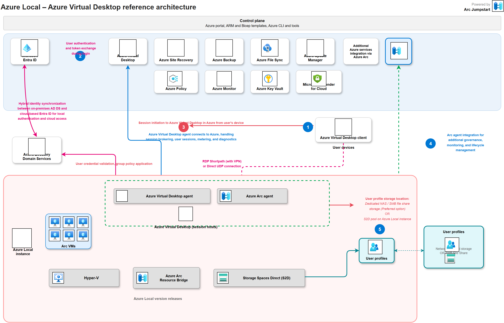

# Architecture Overview

## Solution Summary

This repository provides deployment automation for **Azure Virtual Desktop (AVD)** using **Azure Local** (formerly Azure Stack HCI) as the session-host compute platform.

The AVD architecture has two distinct planes:

- **Control plane** – Hosted in Azure. Includes the host pool, application groups, workspace, and all supporting Azure services (Key Vault, Log Analytics, Storage for FSLogix).
- **Session-host plane** – Hosted on-premises on Azure Local clusters. VMs are created as Arc-enabled virtual machines and registered with the AVD host pool in Azure.

---

## High-Level Architecture

<figure markdown="span">
  
  <figcaption>AVD on Azure Local — control plane in Azure, session hosts and SOFS on-premises, connected via Arc Resource Bridge and Arc-enabled AVD agent registration.</figcaption>
</figure>

---

## Key Components

| Component | Location | Description |
|-----------|----------|-------------|
| **Host Pool** | Azure | Logical grouping of session hosts; defines pooled vs. personal type |
| **Application Group** | Azure | Collection of apps or desktops published to users |
| **Workspace** | Azure | User-facing aggregator for one or more application groups |
| **Log Analytics Workspace** | Azure | Diagnostics, monitoring, and Azure Monitor integration |
| **Diagnostic Settings** | Azure | Sends AVD control-plane diagnostic categories to Log Analytics |
| **RBAC Assignments** | Azure | Least-privilege role assignments for AVD users and VM login roles |
| **Key Vault** | Azure | Stores domain-join credentials, registration tokens, and certificates |
| **Storage Account** | Azure | Optional: MSIX app attach packages or cloud-side FSLogix share |
| **Azure Local Cluster** | On-premises | Hyper-converged infrastructure running Storage Spaces Direct |
| **Arc Resource Bridge** | Azure Local | Enables Azure to manage on-premises VMs as Arc-enabled resources |
| **Session Host VMs** | Azure Local | Windows VMs running the AVD Agent and FSLogix Agent |
| **SOFS / FSLogix** | Azure Local | SMB share providing profile containers (companion repo) |

---

## Identity Options

| Option | Description |
|--------|-------------|
| **Active Directory Domain Services (AD DS)** | Traditional on-premises domain; session hosts domain-joined |
| **Microsoft Entra ID + AD DS hybrid** | Hybrid join using Entra Connect; supports Conditional Access |
| **Microsoft Entra ID only** | Entra-joined session hosts; requires FSLogix cloud cache or Azure Files |

---

## Network Considerations

- Session hosts require outbound HTTPS (443) to Azure for AVD broker, Entra ID, and Windows Update endpoints.
- RDP traffic from clients terminates at the AVD gateway in Azure; no inbound firewall rules needed on-premises.
- SMB traffic for FSLogix (port 445) between session hosts and SOFS stays on the local network.
- Use a dedicated storage/management VLAN for intra-cluster and SOFS traffic.
- DNS must resolve both Azure endpoints and on-premises names from session-host VMs.

---

## Storage Sizing Guidance

| User Count | FSLogix VHD Size | Recommended SOFS CSV |
|------------|-----------------|----------------------|
| Up to 100  | 30 GB / user    | ~3 TB usable         |
| 100 – 500  | 30 GB / user    | ~15 TB usable        |
| 500+       | 30 GB / user    | Scale horizontally   |

---

## Operational Baseline

- Canonical configuration contract is `config/variables.yml` validated by `config/schema/variables.schema.json`.
- Bicep is the strongest direct path; Terraform, ARM, PowerShell, and Ansible consume mapped/derived values.
- Monitoring is required: host pool, application group, and workspace diagnostics route to Log Analytics.
- Identity is required: role assignments for AVD users and VM login groups are managed as code.
- FSLogix profile settings are configured post-provisioning (or extension-based) and validated in test scenarios.

Reference docs:

- `docs/reference/variable-mapping.md`
- `docs/reference/tool-parity-matrix.md`
- `docs/reference/phase-ownership.md`
- `docs/reference/monitoring-queries.md`

---

## Related Resources

- [AVD on Azure Local overview](https://learn.microsoft.com/en-us/azure/virtual-desktop/azure-local-overview)
- [Azure Local documentation](https://learn.microsoft.com/en-us/azure/azure-local/)
- [FSLogix documentation](https://learn.microsoft.com/en-us/fslogix/)
- [Arc Resource Bridge](https://learn.microsoft.com/en-us/azure/azure-arc/resource-bridge/overview)
- [Companion SOFS/FSLogix repository](https://github.com/AzureLocal/azurelocal-sofs-fslogix)

## Extended Documentation

- [Architecture Deep Design](deep-design.md)
- [FSLogix Integration Guide](fslogix-integration.md)
- [Host Pool Options](../reference/host-pool-options.md)
- [RBAC Reference](../reference/rbac.md)
- [Monitoring Queries](../reference/monitoring-queries.md)
- [Cost Management](../operations/cost-management.md)
- [Defender Operations](../security/defender-operations.md)
- [RemoteApps Guide](../guides/rdapps.md)
- [Docs Validation Checklist](../reference/docs-validation-checklist.md)
