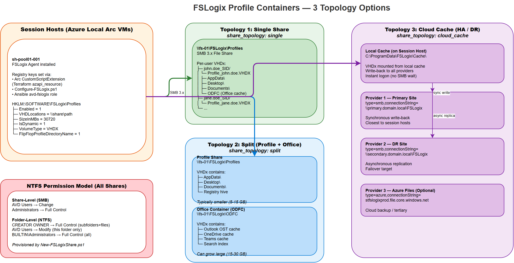

# FSLogix Profile Containers

This guide explains everything about FSLogix profile container deployment — what gets built on each session host, the three topology options, exactly how each IaC tool configures it, and how the storage and permissions work.

## What FSLogix Does and Why It Exists

Without FSLogix, every time a user logs into a **different** session host in a pooled host pool, they get a fresh default Windows profile — no settings, no Outlook cache, no desktop shortcuts. FSLogix solves this by mounting a per-user VHDx file from an SMB share at logon. The VHDx looks like a local `C:\Users\<username>` profile to Windows, but it's actually a virtual disk stored on the network. When the user logs off, the VHDx is cleanly unmounted. Next logon — even on a completely different session host — the same VHDx is mounted and the user gets their full profile back.

**What gets installed:** The FSLogix agent is pre-installed in the Windows 11 Multi-Session gallery image. No separate install is needed. Configuration is purely via Windows Registry keys.



> *Open the [draw.io source](../assets/diagrams/avd-fslogix.drawio) for an editable version.*

---

## What Gets Deployed

FSLogix deployment has two parts: **the SMB share** (storage infrastructure) and **the session host registry configuration** (per-VM settings).

### Part 1: SMB Share (Storage)

The automation creates or validates an SMB file share where VHDx files will be stored. On Azure Local, this is typically a Scale-Out File Server (SOFS) share on the cluster itself — see the [azurelocal-sofs-fslogix companion repository](https://github.com/AzureLocal/azurelocal-sofs-fslogix). The share must:

- Be accessible from all session hosts over SMB 3.x (port 445)
- Have NTFS permissions set correctly (see permissions section below)
- Have enough capacity for all users (see sizing section below)

### Part 2: Session Host Registry Configuration

On each session host VM, the automation writes Windows Registry keys that tell the FSLogix agent where to find the share and how to behave. These registry keys are applied via a `CustomScriptExtension` deployed to each Arc-enabled VM.

**Base registry keys set on every session host (all topologies):**

| Registry Path | Value Name | Type | Value | Purpose |
|---|---|---|---|---|
| `HKLM:\SOFTWARE\FSLogix\Profiles` | `Enabled` | DWORD | `1` | Turns FSLogix profile containers on. |
| `HKLM:\SOFTWARE\FSLogix\Profiles` | `SizeInMBs` | DWORD | `30000` | Maximum VHDx size per user in MB. Default 30 GB. Controls how large a user's profile can grow. |
| `HKLM:\SOFTWARE\FSLogix\Profiles` | `VolumeType` | String | `VHDX` | VHDx format. VHDX is strongly preferred over VHD — supports up to 64 TB and is more resilient. |
| `HKLM:\SOFTWARE\FSLogix\Profiles` | `FlipFlopProfileDirectoryName` | DWORD | `0` or `1` | Changes folder naming from `SID_username` to `username_SID`. Flip-flop is easier to browse. |

**Additional keys per topology** — see topology sections below.

---

## Topology Options — Detailed

### Single Share (`single`)

**What it is:** One VHDx file per user, all stored on one SMB share. Simplest possible setup.

**How it works at logon:**

1. User initiates RDP to a session host in the pooled host pool
2. FSLogix agent reads `VHDLocations` from registry → gets the UNC path
3. Agent connects to the share over SMB 3.x, opens or creates `\\share\Profiles\<SID>_<username>\Profile_<username>.VHDX`
4. VHDx is mounted as a read/write disk and symlinked to `C:\Users\<username>`
5. Windows logon continues with the profile loaded from the VHDx

**Registry key set:**

| Registry Path | Value Name | Value |
|---|---|---|
| `HKLM:\SOFTWARE\FSLogix\Profiles` | `VHDLocations` | `\\fs-01.domain.local\FSLogix\Profiles` |

**Folder structure on the share:**

```
\\fs-01.domain.local\FSLogix\Profiles\
├── S-1-5-21-...-1001_jsmith\
│   └── Profile_jsmith.VHDX        ← 30 GB max, dynamically expanding
├── S-1-5-21-...-1002_jdoe\
│   └── Profile_jdoe.VHDX
└── ...
```

**Configuration:**

```yaml
fslogix:
  enabled: true
  share_topology: single
  vhd_size_mb: 30000
  vhd_type: VHDX
  flip_flop_name: false
  single:
    vhd_path: "\\\\fs-01.domain.local\\FSLogix\\Profiles"
```

**Best for:** Small/medium deployments (< 200 users), single-site, simplest to operate.

---

### Split — Three Shares (`split`)

**What it is:** Three separate storage areas per user — **Profiles** (desktop, AppData general settings), **ODFC** (Office Data File Container — Outlook OST, OneDrive cache, Teams cache), and **AppData** (redirected via Folder Redirection GPO). This matches [Option B in the azurelocal-sofs-fslogix companion repository](https://github.com/AzureLocal/azurelocal-sofs-fslogix), which provisions three S2D volumes and three SOFS shares with capacity split ~55% / ~35% / ~10%.

**Why split into three:** Office cache can be huge (10+ GB for heavy Outlook users), and AppData contains application-specific data that benefits from separate management. Splitting lets you:

- Apply different backup/replication policies (ODFC is recreatable from Exchange, profile is not, AppData is low-priority)
- Set different size limits (smaller profile, larger ODFC)
- Isolate the I/O workload (ODFC is very write-heavy)
- Manage AppData growth independently (application caches, browser data)

**Registry keys set:**

| Registry Path | Value Name | Value |
|---|---|---|
| `HKLM:\SOFTWARE\FSLogix\Profiles` | `VHDLocations` | `\\FSLogixSOFS\Profiles` |
| `HKLM:\SOFTWARE\Policies\FSLogix\ODFC` | `Enabled` | `1` |
| `HKLM:\SOFTWARE\Policies\FSLogix\ODFC` | `VHDLocations` | `\\FSLogixSOFS\ODFC` |

**AppData** is handled via **Folder Redirection GPO** (not a VHDx container) — the GPO redirects `%APPDATA%` to `\\FSLogixSOFS\AppData\%USERNAME%`. This keeps AppData off the profile VHDx and on its own dedicated share.

**Configuration:**

```yaml
fslogix:
  enabled: true
  share_topology: split
  split:
    profile_share: "\\\\FSLogixSOFS\\Profiles"
    office_share: "\\\\FSLogixSOFS\\ODFC"
    appdata_share: "\\\\FSLogixSOFS\\AppData"
```

**SOFS share capacity planning (Option B):**

| Share | S2D Volume | Capacity % | Example (61 TB total) |
|---|---|---|---|
| `Profiles` | `Profiles` | ~55% | 33,485 GB |
| `ODFC` | `ODFC` | ~35% | 21,299 GB |
| `AppData` | `AppData` | ~10% | 6,144 GB |

**Best for:** Medium/large environments (50+ users), production deployments, heavy Outlook/Teams usage, separate backup requirements.

---

### Backup (`backup`)

**What it is:** A storage-level resilience strategy that protects FSLogix data using **Storage Replica** (synchronous or asynchronous block-level replication between SOFS volumes) and/or **Azure Backup MARS agent** (offsite backup to Azure Recovery Services vault). This is a **storage infrastructure concern** — it does NOT change session host registry configuration. Session hosts still mount the primary SOFS shares using `VHDLocations` (single or split topology).

**How it works:**

1. **Storage Replica** — Replicates the SOFS S2D volume(s) to a secondary SOFS or another Azure Local cluster volume at the block level. Provides near-zero RPO failover. Configured on the storage infrastructure, transparent to session hosts.
2. **Azure Backup MARS agent** — Runs on the SOFS cluster nodes, backs up FSLogix VHDx files to an Azure Recovery Services vault. Provides offsite DR with configurable retention policies (daily/weekly/monthly).

**Why this is a separate topology:** Unlike single and split (which configure session host registry keys), backup is managed at the storage layer by the [azurelocal-sofs-fslogix companion repository](https://github.com/AzureLocal/azurelocal-sofs-fslogix). The AVD session hosts are unaware of backup — they always mount the primary shares.

**Configuration (storage-level, in sofs-fslogix repo):**

```yaml
backup:
  storage_replica:
    enabled: true
    target_server: "sofs-02.domain.local"
    replication_mode: synchronous     # synchronous | asynchronous
  azure_backup:
    enabled: true
    vault_name: "rsv-fslogix-backup"
    retention_daily: 7
    retention_weekly: 4
    retention_monthly: 12
```

!!! info "Cloud Cache"
    FSLogix Cloud Cache (`CCDLocations`) is a **separate optional add-on** that can be layered on top of any topology. It caches VHDx data locally on the session host and asynchronously replicates to multiple SMB targets. Cloud Cache is NOT a primary topology — it is configured independently when multi-site active-active access is required. See the [azurelocal-sofs-fslogix docs](https://github.com/AzureLocal/azurelocal-sofs-fslogix) for Cloud Cache configuration.

**Best for:** Production environments requiring data protection, compliance with backup retention policies, disaster recovery across sites.

---

## NTFS Permissions — Why They Matter

FSLogix requires a specific permission model on the SMB share. Get this wrong and users either can't create profiles, or they can read each other's profiles (security issue).

### Share-Level Permissions

| Principal | Permission | Purpose |
|---|---|---|
| `Everyone` or `AVD Users` | Change | Allows users to connect and write to the share root. FSLogix creates per-user subfolders. |
| `BUILTIN\Administrators` | Full Control | Admin access for troubleshooting and maintenance. |

### Folder-Level (NTFS) Permissions on the Share Root

| Principal | Permission | Applies To | Purpose |
|---|---|---|---|
| `CREATOR OWNER` | Full Control | **Subfolders and files only** | Each user gets full control over their own profile folder (because they created it). This is the critical security boundary — users can only access folders they created. |
| `AVD Users Group` | Modify | **This folder only** | Allows users to create their top-level profile folder. Does NOT grant access to other users' folders. |
| `BUILTIN\Administrators` | Full Control | **This folder, subfolders, and files** | Admin access for troubleshooting. |

!!! warning "Common Mistake"
    Do NOT give `AVD Users` permissions on subfolders/files. That would allow users to read each other's VHDx files. The `CREATOR OWNER` approach ensures isolation.

---

## What Each IaC Tool Deploys — Resource by Resource

### Terraform (`src/terraform/fslogix.tf`)

Terraform deploys the session host configuration via a `CustomScriptExtension` on each Arc-enabled VM:

| Terraform Resource | What It Does |
|---|---|
| `azapi_resource.fslogix_ext` | Creates a `Microsoft.HybridCompute/machines/extensions` of type `CustomScriptExtension` on each session host VM. Uses `for_each = var.fslogix_enabled ? toset(local.vm_names) : toset([])` to iterate over all VMs. |

**How the script is built:** The `locals` block in `fslogix.tf` constructs a PowerShell one-liner from `fslogix_base_commands` (base registry keys) + `fslogix_topology_commands` (topology-specific keys). The one-liner is passed to `protectedSettings.commandToExecute`. This means the registry configuration is applied at deployment time, not at every boot.

**Terraform variables:**

```hcl
fslogix_enabled              = true
fslogix_share_topology       = "single"          # single | split
fslogix_single_vhd_path      = "\\\\FSLogixSOFS\\Profiles"
fslogix_size_in_mb           = 30000
fslogix_vhd_type             = "VHDX"
fslogix_flip_flop            = false
# For split topology (Option B — three shares):
# fslogix_split_profile_path = "\\\\FSLogixSOFS\\Profiles"
# fslogix_split_office_path  = "\\\\FSLogixSOFS\\ODFC"
# fslogix_split_appdata_path = "\\\\FSLogixSOFS\\AppData"
```

### Bicep / ARM

FSLogix configuration is applied via the same `CustomScriptExtension` mechanism as Terraform. The Bicep `session-hosts.bicep` module includes the FSLogix extension as a child resource of each session host VM.

### PowerShell

Two scripts handle FSLogix:

- **`New-FSLogixShare.ps1`** — Creates the SMB share on the file server, sets NTFS permissions (CREATOR OWNER, AVD users group, Administrators), and validates SMB connectivity from the deployment machine.
- **`Configure-FSLogix.ps1`** — Loops over all session hosts, connects via `Invoke-AzRestMethod` to deploy the CustomScriptExtension that writes the registry keys.

```powershell
# Step 1: Create the share (run once)
.\src\powershell\New-FSLogixShare.ps1 -ConfigPath config/variables.yml

# Step 2: Configure session hosts (run after host provisioning)
.\src\powershell\Configure-FSLogix.ps1 -ConfigPath config/variables.yml
```

### Ansible (`src/ansible/roles/avd-fslogix/tasks/main.yml`)

The Ansible role uses `azure_rm_resource` to deploy the CustomScriptExtension on each session host. The PowerShell registry commands are passed as the `commandToExecute` in `protectedSettings`.

```bash
ansible-playbook src/ansible/playbooks/site.yml -i inventory.yml --tags fslogix
```

---

## Sizing Guidelines

| Users | Recommended VHDx Max Size | Estimated Share Capacity | Rationale |
|---|---|---|---|
| 1–50 | 30 GB | 2 TB | Generous per-user allocation. VHDx files are dynamically expanding — actual usage will be much less than max. |
| 50–200 | 30 GB | 6 TB | Assume ~50% average fill rate at steady state. |
| 200–500 | 20 GB | 10 TB | Reduce per-user max to control share growth. Implement quotas. |
| 500+ | 15 GB | Plan per user | Large deployments need IOPS planning too. ~5–10 IOPS per user at steady state, ~50 IOPS during logon storm. |

**IOPS considerations:** FSLogix VHDx I/O is primarily random reads with intermittent writes. Logon storms (everyone arriving at 9 AM) create a burst of ~50 IOPS per user for 30–60 seconds. The SOFS CSV must handle this peak. Azure Local clusters with NVMe or SSD cache tiers handle this well.

---

## Troubleshooting

| Symptom | Root Cause | Resolution |
|---|---|---|
| Profile not loading — user gets temp profile | `HKLM:\SOFTWARE\FSLogix\Profiles\Enabled` is not `1`, or the VHD path is unreachable | Verify registry keys on the session host. Test SMB connectivity: `Test-Path \\fs-01\FSLogix\Profiles` from the VM. |
| Slow logon (30+ seconds) | SMB share is overloaded, or VHDx is fragmented/oversized | Check SOFS IOPS and latency. Consider splitting to reduce VHDx size. Defragment VHDx files offline. |
| VHDx locked — "profile in use" error | Previous session did not cleanly unmount the VHDx | Check for orphaned sessions on other hosts: `Get-AzWvdUserSession`. Force logoff the stuck session. If persistent, check FSLogix event log (`Microsoft-FSLogix-Apps/Operational`). |
| Permission denied on share | NTFS permissions are wrong — user can't create their profile folder | Verify NTFS permissions match the table above. Most common mistake: missing `CREATOR OWNER` or `AVD Users` having wrong scope. |
| Cloud Cache not replicating | Secondary provider is unreachable or the CCDLocations string is malformed | Cloud Cache is an optional add-on, not a primary topology. Check FSLogix event log for replication errors. Validate the connection string format. Test SMB connectivity to all providers. See the sofs-fslogix companion repo for Cloud Cache configuration. |
