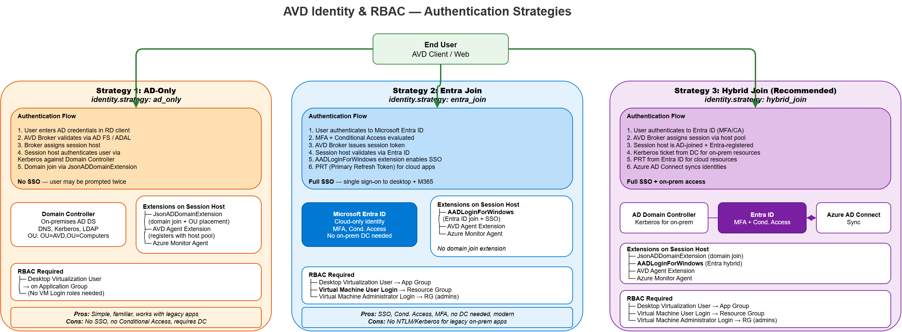

# Identity & RBAC

Identity configuration determines how users authenticate to AVD session hosts and what RBAC roles are needed.



> *Open the [draw.io source](../assets/diagrams/avd-identity.drawio) for an editable version.*

The diagram above compares the three identity strategies side-by-side — **AD-Only**, **Entra Join**, and **Hybrid Join** — showing the authentication flow, required VM extensions, RBAC role assignments, and the pros/cons of each approach.

## Identity Strategies

### AD-Only (`ad_only`)

Traditional Active Directory domain join. Users authenticate with AD credentials.

- Session hosts join AD domain via `JsonADDomainExtension`
- No Entra ID integration — no SSO
- Simplest setup, requires on-premises AD infrastructure

### Entra Join (`entra_join`)

Session hosts are Entra ID joined. Users authenticate with Entra ID credentials.

- No AD domain controller required
- Single sign-on via `AADLoginForWindows` extension
- Requires `Virtual Machine User Login` RBAC role

### Hybrid Join (`hybrid_join`)

Session hosts are domain-joined AND Entra ID registered. Best of both worlds.

- AD domain join + Entra ID hybrid join
- SSO via `AADLoginForWindows` extension
- Supports conditional access policies
- Requires Azure AD Connect sync

## RBAC Roles

| Role | Scope | Purpose |
|------|-------|---------|
| Desktop Virtualization User | Application Group | Connect to desktops/apps |
| Virtual Machine User Login | Resource Group | Sign in to VMs via Entra ID |
| Virtual Machine Administrator Login | Resource Group | Admin access via Entra ID |
| Desktop Virtualization Power On Contributor | Host Pool | Start VM on Connect |

## Configuration

```yaml
identity:
  strategy: hybrid_join  # ad_only | entra_join | hybrid_join
  entra_id:
    tenant_id: "00000000-0000-0000-0000-000000000000"
    avd_users_group_id: "00000000-0000-0000-0000-000000000000"
    avd_admins_group_id: "00000000-0000-0000-0000-000000000000"
  domain:
    fqdn: "iic.local"
    ou_path: "OU=AVD,OU=Computers,DC=iic,DC=local"
    join_account: "svc-domainjoin@iic.local"
  rbac:
    assign_roles: true
```

## Deployment

### PowerShell

```powershell
.\src\powershell\Configure-AVDIdentity.ps1 -ConfigPath config/variables.yml
```

### Terraform

```hcl
identity_strategy  = "hybrid_join"
avd_user_group_id  = "00000000-..."
avd_admin_group_id = "00000000-..."
```

### Ansible

```bash
ansible-playbook src/ansible/playbooks/site.yml -i inventory.yml --tags identity
```

## Conditional Access (Recommended)

For `entra_join` or `hybrid_join`, configure Conditional Access policies:

1. **Require MFA** for AVD connections
2. **Require compliant device** for RDP client
3. **Block legacy authentication**
4. **Session controls** — sign-in frequency, persistent browser
