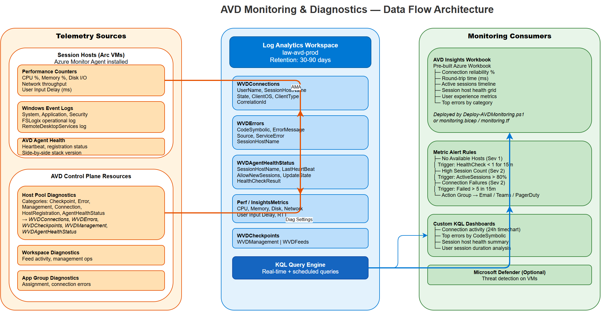

# Monitoring & Diagnostics

AVD monitoring uses Azure Monitor, Log Analytics, and AVD Insights to provide visibility into connection activity, session host health, and user experience.

## Architecture



> *Open the [draw.io source](../assets/diagrams/avd-monitoring.drawio) for an editable version.*

The diagram shows the full monitoring data flow:

- **Telemetry Sources** — Session hosts emit performance counters (CPU, memory, disk, network), Windows Event Logs, and AVD Agent health via Azure Monitor Agent. Host Pool, Workspace, and App Group resources send diagnostic settings (Connection, Error, Checkpoint, Management, HostRegistration, AgentHealthStatus logs).
- **Log Analytics Workspace** — All telemetry lands in five core tables: `WVDConnections`, `WVDErrors`, `WVDAgentHealthStatus`, `Perf`/`InsightsMetrics`, and `WVDCheckpoints`. The KQL engine powers all downstream queries.
- **Monitoring Consumers** — AVD Insights Workbook provides built-in dashboards. Metric Alert Rules fire on thresholds (e.g., CPU > 85%, active sessions > 90% capacity, connection failures > 5/15min). Custom KQL dashboards and Defender for Cloud extend visibility.

## Configuration

```yaml
monitoring:
  enabled: true
  log_analytics:
    workspace_name: "law-avd-prod"
    resource_group: "rg-avd-prod"
    retention_days: 30
  diagnostics:
    log_categories:
      - Checkpoint
      - Error
      - Management
      - Connection
      - HostRegistration
      - AgentHealthStatus
  defender:
    enabled: false
  alerts:
    enabled: true
```

## Deployment

### PowerShell

```powershell
.\src\powershell\Deploy-AVDMonitoring.ps1 -ConfigPath config/variables.yml
```

### Terraform

Set `monitoring_enabled = true` and `alert_rules_enabled = true` in your tfvars.

### Bicep

Deploy the `monitoring.bicep` module after the control plane:

```bash
az deployment group create \
  --resource-group rg-avd-prod \
  --template-file src/bicep/monitoring.bicep \
  --parameters hostPoolName=hp-pool01 ...
```

### Ansible

```bash
ansible-playbook src/ansible/playbooks/site.yml -i inventory.yml --tags monitoring
```

## Key KQL Queries

### Connection Activity (24h)

```kql
WVDConnections
| where TimeGenerated > ago(24h)
| summarize Connections=count() by bin(TimeGenerated, 1h)
| render timechart
```

### Top Errors

```kql
WVDErrors
| where TimeGenerated > ago(24h)
| summarize ErrorCount=count() by CodeSymbolic
| top 10 by ErrorCount desc
```

### Session Host Health

```kql
WVDAgentHealthStatus
| where TimeGenerated > ago(1h)
| summarize arg_max(TimeGenerated, *) by SessionHostName
| project SessionHostName, LastHeartBeat,
    Status=iff(AllowNewSessions, 'Available', 'Unavailable')
```

### User Session Duration

```kql
WVDConnections
| where TimeGenerated > ago(7d)
| where State == "Completed"
| extend Duration = datetime_diff('minute', TimeGenerated, SessionStartTime)
| summarize AvgDuration=avg(Duration), MaxDuration=max(Duration) by UserName
| top 20 by AvgDuration desc
```

## Alert Rules

| Alert | Condition | Severity |
|-------|-----------|----------|
| No Available Hosts | HealthCheckSucceeded < 1 for 15min | 1 (Error) |
| High Session Count | ActiveSessions > 80% capacity | 2 (Warning) |
| Connection Failures | Failed connections > 5 in 15min | 2 (Warning) |
