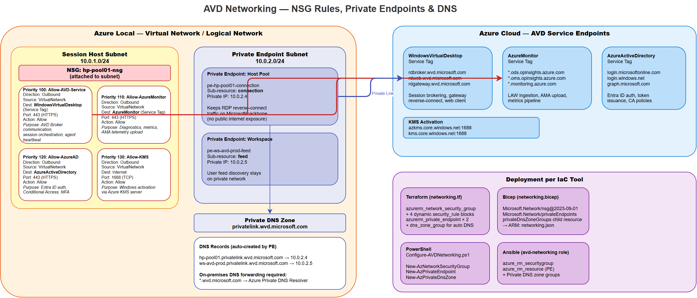

# Networking

This guide explains every networking component deployed for AVD on Azure Local — exactly what NSG rules are created and why each one exists, how private endpoints work for AVD control plane isolation, how DNS resolution ties it together, and how each IaC tool implements the resources.

## Why Networking Configuration Matters

AVD session hosts are Arc-enabled VMs sitting in your Azure Local logical network. They need to talk to several Azure services over the internet to function:

- The **AVD broker** (to register themselves, receive connection assignments, send heartbeats)
- **Entra ID** (to validate user tokens for Hybrid Join)
- **Azure Monitor** (to ship diagnostics and performance counters)
- **Windows KMS** (to activate the Windows license)

Without proper NSG rules, session hosts can't communicate with these services and AVD breaks. With private endpoints, you can move the AVD broker and workspace traffic off the public internet entirely, keeping it on the Microsoft backbone network — important for compliance and security-sensitive environments.



> *Open the [draw.io source](../assets/diagrams/avd-networking.drawio) for an editable version.*

---

## What Gets Deployed

| Azure Resource Type | Resource Name | What It Is |
|---|---|---|
| `Microsoft.Network/networkSecurityGroups` | `${nsg_name}` | Network Security Group attached to the session host subnet. Contains 4 outbound allow rules for AVD-required traffic. |
| `Microsoft.Network/networkSecurityGroups/securityRules` | 4 inline rules (priorities 100-130) | Individual NSG rules allowing outbound HTTPS to Azure service tags + KMS activation. |
| `Microsoft.Network/privateEndpoints` | `${host_pool_name}-pe` | Private endpoint for the AVD Host Pool. Creates a NIC in the PE subnet with a private IP that routes to the AVD `connection` sub-resource. |
| `Microsoft.Network/privateEndpoints` | `${workspace_name}-pe` | Private endpoint for the AVD Workspace. Creates a NIC in the PE subnet with a private IP that routes to the AVD `feed` sub-resource. |
| `Microsoft.Network/privateEndpoints/privateDnsZoneGroups` | Auto-created | Links each private endpoint to the `privatelink.wvd.microsoft.com` DNS zone. Automatically creates A records so that domain names resolve to the private IPs. |

---

## NSG Rules — Every Rule Explained

The NSG has 4 outbound rules, each targeting a specific Azure service tag. Service tags are Microsoft-managed IP address groups that automatically update as Azure adds or changes IP ranges.

### Rule 1: Allow-AVD-Service (Priority 100)

| Property | Value |
|---|---|
| Direction | Outbound |
| Priority | 100 |
| Protocol | TCP |
| Source | `*` (any address in the subnet) |
| Destination | Service Tag: `WindowsVirtualDesktop` |
| Destination Port | 443 (HTTPS) |
| Action | Allow |

**Why it exists:** Session hosts communicate with the AVD control plane over HTTPS 443. This includes:

- **Agent registration** — When a session host boots, the AVD agent (`RDAgentBootLoader`) contacts `rdbroker.wvd.microsoft.com` to register itself in the host pool
- **Heartbeats** — Every 30 seconds, the agent sends a heartbeat. If 3 consecutive heartbeats are missed, the host shows as "Unavailable" in the portal
- **Reverse connect** — When a user connects, the broker tells the session host to establish a reverse-connect WebSocket tunnel through the AVD gateway. This tunnel carries the RDP traffic; no inbound ports needed on the session host
- **Session orchestration** — Load balancing decisions, drain mode signals, and scaling plan commands all flow through this channel

The `WindowsVirtualDesktop` service tag resolves to ~200 IP ranges across Azure regions. Microsoft maintains it — you don't need to update it manually.

### Rule 2: Allow-AzureMonitor (Priority 110)

| Property | Value |
|---|---|
| Direction | Outbound |
| Priority | 110 |
| Protocol | TCP |
| Source | `*` |
| Destination | Service Tag: `AzureMonitor` |
| Destination Port | 443 |
| Action | Allow |

**Why it exists:** If monitoring is enabled, session hosts ship telemetry to Azure Monitor / Log Analytics:

- **Performance counters** — CPU, memory, disk, network via the Azure Monitor Agent (AMA) or legacy Log Analytics agent (MMA)
- **Windows Event Logs** — Application, System, and AVD-specific event channels (`Microsoft-Windows-TerminalServices-*`)
- **AVD Insights data** — Connection quality, session duration, round-trip time

Without this rule, monitoring data never reaches Log Analytics and your AVD Insights workbook shows blank.

### Rule 3: Allow-AzureAD (Priority 120)

| Property | Value |
|---|---|
| Direction | Outbound |
| Priority | 120 |
| Protocol | TCP |
| Source | `*` |
| Destination | Service Tag: `AzureActiveDirectory` |
| Destination Port | 443 |
| Action | Allow |

**Why it exists:** Required for Entra ID authentication in all identity strategies:

- **AD-Only** — Even though session hosts don't use Entra ID for login, the AVD agent still needs Entra ID to validate the broker connection token
- **Hybrid Join** — The `AADLoginForWindows` extension communicates with `login.microsoftonline.com` and `device.login.microsoftonline.com` for device registration and PRT-based SSO. Azure AD Connect sync validation is also required.

> **Note:** Entra-only join is NOT supported on Azure Local. Only `ad_only` and `hybrid_join` strategies are available.

The `AzureActiveDirectory` service tag covers `login.microsoftonline.com`, `graph.microsoft.com`, `device.login.microsoftonline.com`, and related endpoints.

### Rule 4: Allow-KMS (Priority 130)

| Property | Value |
|---|---|
| Direction | Outbound |
| Priority | 130 |
| Protocol | TCP |
| Source | `*` |
| Destination | Service Tag: `Internet` |
| Destination Port | 1688 |
| Action | Allow |

**Why it exists:** Windows VMs must activate their license via the Azure KMS server at `azkms.core.windows.net:1688` (or `kms.core.windows.net:1688`). If activation fails:

- Windows shows "Activate Windows" watermark on the desktop
- After 30 days, the VM enters reduced-functionality mode
- Some Windows features (personalization, certain Group Policy settings) stop working

This rule uses the `Internet` service tag with a specific port (1688) rather than a KMS-specific tag because there is no dedicated Azure KMS service tag. Port 1688 is exclusively used by KMS.

### Default Deny

The NSG's built-in default rules deny all other outbound traffic not explicitly allowed. This means session hosts cannot reach arbitrary internet endpoints — only the four service tags above. If you need additional outbound access (e.g., for application downloads, Windows Update), add rules with priorities above 130.

---

## Private Endpoints — Deep Dive

### What Private Endpoints Do

By default, AVD session hosts communicate with the AVD control plane over public endpoints (`rdbroker.wvd.microsoft.com`, `rdweb.wvd.microsoft.com`). This traffic goes over the public internet, encrypted via TLS 1.2.

Private endpoints create **network interfaces** in your logical network with private IP addresses that route to the AVD service. When DNS is configured correctly, the FQDN `rdbroker.wvd.microsoft.com` resolves to a private IP (e.g., `10.0.2.5`) instead of a public IP. All AVD control plane traffic stays on the Microsoft backbone — it never touches the public internet.

### Two Private Endpoints, Two Sub-Resources

AVD requires two separate private endpoints because the AVD service has two distinct sub-resources:

| Private Endpoint | Sub-Resource | What It Handles |
|---|---|---|
| Host Pool PE | `connection` | Agent registration, heartbeats, reverse-connect tunnels, session orchestration. This is the session host → broker communication. |
| Workspace PE | `feed` | The AVD client feed — when a user opens the AVD client and sees their list of desktops/apps, that request goes to the workspace. This is the client → workspace communication. |

### DNS Zone Configuration

For private endpoints to work, DNS resolution must return the private IP instead of the public IP. This requires:

1. **Private DNS Zone**: `privatelink.wvd.microsoft.com` — created in Azure, linked to your logical network
2. **A Records**: Automatically created by the `privateDnsZoneGroup` when the private endpoint is deployed
3. **DNS Forwarding**: If session hosts use on-premises DNS servers, those servers must forward `privatelink.wvd.microsoft.com` queries to Azure DNS (168.63.129.16)

**How DNS resolution works after private endpoint deployment:**

```
Session host → query: rdbroker.wvd.microsoft.com
           → CNAME: rdbroker.wvd.microsoft.com → rdbroker.privatelink.wvd.microsoft.com
           → A record (from Private DNS Zone): rdbroker.privatelink.wvd.microsoft.com → 10.0.2.5
           → Traffic goes to 10.0.2.5 (private endpoint NIC in PE subnet)
```

### Subnet Design

Private endpoints need their own subnet. Recommendations:

| Property | Recommended Value |
|---|---|
| Subnet Size | `/28` (14 usable IPs) — enough for 2 PEs plus room for future growth |
| Subnet Name | `snet-pe` or `snet-private-endpoints` |
| NSG | Optional on PE subnet (PEs don't need outbound rules — they're the target, not the source) |
| Service Endpoints | Not needed — PEs are different from service endpoints |

---

## Configuration — Every Field Explained

```yaml
networking:
  private_endpoints:
    enabled: false                     # Whether to deploy private endpoints for the host pool and workspace.
                                       # If false, AVD uses public endpoints (still encrypted via TLS 1.2).
                                       # If true, requires a dedicated PE subnet and private DNS zone.
    subnet_id: "/subscriptions/.../subnets/pe-subnet"
                                       # Full resource ID of the subnet where private endpoint NICs are created.
                                       # This should be a separate subnet from session hosts.
                                       # The subnet must have enough IP addresses (at least 2 for host pool + workspace PEs).
    dns_zone_id: ""                    # Full resource ID of the privatelink.wvd.microsoft.com DNS zone.
                                       # If empty, the private endpoint is created without DNS zone group —
                                       # you must create A records manually or via Azure Policy.
  nsg:
    enabled: true                      # Whether to create the NSG with AVD outbound rules.
                                       # If false, no NSG is deployed (assumes you manage NSG externally).
    name: "hp-pool01-nsg"             # Name of the NSG resource. Must be unique within the resource group.
                                       # The NSG is created but NOT automatically associated with a subnet —
                                       # you must attach it to the session host subnet via subnet properties
                                       # or a separate association resource.
```

---

## What Each IaC Tool Deploys — Resource by Resource

### Terraform (`src/terraform/networking.tf`)

| Terraform Resource | Azure Resource Created | Condition | What It Does |
|---|---|---|---|
| `azurerm_network_security_group.avd_nsg[0]` | NSG | `var.nsg_enabled == true` | Creates the NSG with 4 inline `security_rule` blocks (priorities 100-130). Each rule uses a service tag destination. |
| `azurerm_private_endpoint.host_pool[0]` | Host Pool Private Endpoint | `var.private_endpoints_enabled == true` | Creates PE in `var.private_endpoint_subnet_id` with `private_service_connection` targeting the host pool resource and sub-resource `connection`. |
| `azurerm_private_endpoint.workspace[0]` | Workspace Private Endpoint | `var.private_endpoints_enabled == true` | Creates PE targeting the workspace resource and sub-resource `feed`. |
| (inline) `private_dns_zone_group` block | DNS Zone Group | `var.private_dns_zone_id != ""` | Inside each PE resource — links the PE to the private DNS zone so A records are auto-created. |

**Terraform variables:**

```hcl
nsg_enabled                = true
nsg_name                   = "hp-pool01-nsg"
private_endpoints_enabled  = true
private_endpoint_subnet_id = "/subscriptions/.../subnets/snet-pe"
private_dns_zone_id        = "/subscriptions/.../privateDnsZones/privatelink.wvd.microsoft.com"
```

### Bicep (`src/bicep/networking.bicep`)

Same resources implemented in Bicep:

| Bicep Resource | ARM Type | Notes |
|---|---|---|
| `nsg` resource | `Microsoft.Network/networkSecurityGroups@2023-04-01` | Contains `securityRules` array with 4 rules. Same service tags and priorities as Terraform. |
| `hostPoolPe` resource | `Microsoft.Network/privateEndpoints@2023-04-01` | `privateLinkServiceConnections` array with `groupIds: ['connection']`. |
| `workspacePe` resource | `Microsoft.Network/privateEndpoints@2023-04-01` | `privateLinkServiceConnections` array with `groupIds: ['feed']`. |
| `dnsZoneGroup` child resource | `Microsoft.Network/privateEndpoints/privateDnsZoneGroups@2023-04-01` | Nested under each PE. References `privateDnsZoneId` parameter. |

```bash
az deployment group create \
  --resource-group rg-avd-prod \
  --template-file src/bicep/networking.bicep \
  --parameters nsgName='hp-pool01-nsg' \
               nsgEnabled=true \
               privateEndpointsEnabled=true \
               privateEndpointSubnetId='/subscriptions/.../subnets/snet-pe' \
               hostPoolId='<host-pool-resource-id>' \
               workspaceId='<workspace-resource-id>' \
               privateDnsZoneId='/subscriptions/.../privateDnsZones/privatelink.wvd.microsoft.com'
```

### PowerShell (`src/powershell/Configure-AVDNetworking.ps1`)

The PowerShell script runs these steps in order:

1. Loads configuration from YAML
2. If `nsg.enabled`: Creates NSG via `New-AzNetworkSecurityGroup`
3. Adds 4 rules via `Add-AzNetworkSecurityRuleConfig` — same service tags and priorities
4. Calls `Set-AzNetworkSecurityGroup` to apply the rules
5. If `private_endpoints.enabled`: Creates host pool PE via `New-AzPrivateEndpoint` with `-GroupId "connection"`
6. Creates workspace PE with `-GroupId "feed"`
7. If DNS zone is specified: creates DNS zone groups via `New-AzPrivateDnsZoneGroup`

```powershell
.\src\powershell\Configure-AVDNetworking.ps1 -ConfigPath config/variables.yml
```

### Ansible (`src/ansible/roles/avd-networking/tasks/main.yml`)

Uses `azure_rm_securitygroup` for the NSG, `azure_rm_resource` for private endpoints. Tagged as `networking`.

```bash
ansible-playbook src/ansible/playbooks/site.yml -i inventory.yml --tags networking
```

---

## Troubleshooting

| Symptom | Root Cause | Resolution |
|---|---|---|
| Session hosts show "Unavailable" in host pool | NSG blocks outbound 443 to `WindowsVirtualDesktop` service tag | Verify NSG rule with priority 100 exists. Test: `Test-NetConnection rdbroker.wvd.microsoft.com -Port 443` from session host. |
| AVD Insights workbook shows no data | NSG blocks outbound 443 to `AzureMonitor` service tag, or monitoring agent not installed | Verify rule priority 110. Check if AMA/MMA agent is running on session hosts. |
| Hybrid Join fails — "Unable to register device" | NSG blocks outbound 443 to `AzureActiveDirectory` service tag | Verify rule priority 120. Test: `Test-NetConnection login.microsoftonline.com -Port 443` |
| Windows "Activate Windows" watermark | NSG blocks outbound 1688 to KMS server | Verify rule priority 130. Test: `Test-NetConnection azkms.core.windows.net -Port 1688` |
| Private endpoint deployed but FQDN still resolves to public IP | DNS zone group not created, or DNS forwarding not configured | Check: `nslookup rdbroker.wvd.microsoft.com` — should return `10.x.x.x` (private IP). If it returns a public IP, verify the `privateDnsZoneGroup` resource exists and your DNS server forwards to `168.63.129.16`. |
| Users can't see desktops in AVD client after enabling PE | Workspace PE missing or `feed` sub-resource not configured | Verify both PEs exist — one for host pool (`connection`) and one for workspace (`feed`). |
