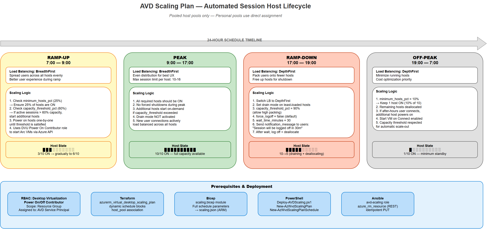

# Scaling Plans

This guide explains exactly how AVD scaling plans work — what Azure resource gets deployed, how the autoscaler evaluates capacity every 15 minutes, what happens in each of the four schedule phases, the difference between the two load-balancing algorithms, and how each IaC tool implements it.

## Why Scaling Plans Exist

AVD session hosts are VMs. VMs cost money when they're running, even if nobody is using them. A scaling plan tells the AVD service: "At 7 AM, start turning on hosts. At 9 AM, make sure there's plenty of capacity. At 5 PM, start draining users and shutting down hosts. Overnight, keep just a handful running."

Without a scaling plan, you either leave all hosts running 24/7 (expensive), or manually turn them on and off (error-prone, somebody forgets on Friday).



> *Open the [draw.io source](../assets/diagrams/avd-scaling.drawio) for an editable version.*

!!! note "Pooled vs. Personal"
    **Pooled host pools** support full capacity-based autoscaling (this guide's focus). **Personal host pools** now also support scaling plans, but with a different model — personal scaling plans deallocate VMs based on user session state (signed out / disconnected), not capacity thresholds. This repo's IaC deploys scaling plans only for Pooled pools: `count = var.scaling_enabled && var.host_pool_type == "Pooled" ? 1 : 0`.

---

## Azure Local Considerations

Scaling plans work on Azure Local session hosts — Microsoft explicitly supports both **power management autoscaling** and **Start VM on Connect** for session hosts on Azure and Azure Local. However, running on-premises introduces important differences compared to Azure-hosted VMs:

!!! warning "Azure Local-Specific Caveats"
    1. **Fixed hardware capacity** — Unlike Azure, you cannot burst beyond your physical cluster's compute capacity. Design `minimum_hosts_pct` and capacity thresholds conservatively. If all physical cores are committed, the autoscaler cannot power on additional VMs.
    2. **Azure connectivity required** — The AVD autoscaler is a cloud-hosted service. It sends power commands through Azure Arc to the on-premises cluster. If the Azure Local cluster loses connectivity to Azure, scaling actions will not execute until the connection is restored.
    3. **Power action latency** — Starting an Arc-enabled VM on Azure Local involves Azure API → Arc agent → Azure Local cluster → Hyper-V. This may add a few seconds of latency compared to starting an Azure VM directly. Factor this into ramp-up `minimum_hosts_pct` to pre-warm hosts before peak.
    4. **Dynamic autoscaling (preview) is not confirmed for Azure Local** — Dynamic autoscaling (which creates/deletes VMs, not just power on/off) is currently only available in Azure. Azure Local VM provisioning requires Arc VM creation with specific logical networks and on-premises images, which the dynamic autoscaler does not support.
    5. **Host pool isolation** — Azure and Azure Local session hosts cannot be mixed in the same host pool. Create separate host pools per environment.

| Feature | Azure VMs | Azure Local (Arc VMs) |
|---|---|---|
| Power management autoscale | Supported | Supported |
| Start VM on Connect | Supported | Supported |
| Dynamic autoscale (create/delete VMs) | Preview | Not supported |
| Resource type | `Microsoft.Compute/virtualMachines` | `Microsoft.HybridCompute/machines` |
| RBAC role | DVU Power On/Off Contributor | Same role, same subscription-level assignment |

---

## What Gets Deployed

| Azure Resource Type | Resource Name | What It Is |
|---|---|---|
| `Microsoft.DesktopVirtualization/scalingPlans` | `${host_pool_name}-scaling` | The scaling plan itself — contains schedule definitions, algorithm settings, capacity thresholds, and the link to the host pool. |
| `Microsoft.DesktopVirtualization/scalingPlans/pooledSchedules` | One per schedule entry | Child resource of the scaling plan — defines the four phase times, algorithms, and thresholds for a specific day pattern (e.g., weekdays). |
| `Microsoft.Authorization/roleAssignments` | Auto-created | The AVD service principal (first-party app `9cdead84-a844-4324-93f2-b2e6bb768d07`) must have **Desktop Virtualization Power On/Off Contributor** on the RG so it can actually start and stop VMs. |

---

## How the Autoscaler Works

The AVD autoscaler is a Microsoft-managed service — you don't deploy it. Once you create a scaling plan and associate it with a host pool, the service evaluates every **15 minutes** (approximately) whether to turn hosts on or off.

### Evaluation Logic

Every 15 minutes, the autoscaler:

1. **Reads the current phase** from the schedule (based on the current time in the configured time zone)
2. **Counts total sessions** across all running session hosts
3. **Calculates used capacity percentage**: `(total sessions / total max sessions across running hosts) × 100`
4. **Compares to the capacity threshold** for the current phase
5. **If used capacity > threshold**: turns on additional hosts (one at a time, wait for it to report healthy, then re-evaluate)
6. **If used capacity < threshold** (and in ramp-down or off-peak): drains a host and powers it off

### "Drain mode" Explained

When the autoscaler decides to power off a host:

1. It sets the host to **Drain mode** — no new sessions are assigned to it
2. Existing users continue working — they're NOT kicked off immediately
3. If `force_logoff` is `true` and `wait_time_minutes` has elapsed, users get the notification message and are forcefully signed out
4. If `force_logoff` is `false`, the autoscaler waits for all users to sign out naturally — the host stays running until it's empty
5. Once all sessions are gone, the VM is deallocated (stopped and not billed for compute)

---

## Schedule Phases — Deep Dive

### Ramp-Up Phase

**Purpose:** Get hosts ready before the workday starts so users don't wait for VMs to boot.

**How it works:**

1. The autoscaler starts at the configured `ramp_up.start_time` (e.g., 07:00)
2. It calculates how many hosts are needed to meet `minimum_hosts_pct` — example: if you have 20 session hosts and `minimum_hosts_pct: 25`, at least 5 hosts must be running at 7:00 AM
3. It powers on hosts one by one until the minimum is met
4. As early-bird users log in, if the `capacity_threshold_pct` is exceeded, additional hosts are powered on
5. **Load-balancing algorithm**: typically `BreadthFirst` (spread users across hosts for best experience while they trickle in)

**Configuration fields:**

| Field | Type | What It Controls | Example |
|---|---|---|---|
| `start_time` | String (HH:MM) | When this phase begins | `"07:00"` |
| `algorithm` | `BreadthFirst` or `DepthFirst` | How sessions are assigned to running hosts | `BreadthFirst` |
| `minimum_hosts_pct` | Integer (0-100) | Percentage of total hosts that must be running during this phase | `25` |
| `capacity_threshold_pct` | Integer (0-100) | When used capacity hits this %, turn on another host | `60` |

### Peak Phase

**Purpose:** Maximum availability. All needed hosts are running.

**How it works:**

1. Starts at `peak.start_time` (e.g., 09:00)
2. No minimum host percentage — the autoscaler only turns on more hosts if `capacity_threshold_pct` is exceeded
3. No hosts are turned off during peak, even if utilization drops
4. **Load-balancing algorithm**: typically `BreadthFirst` for best user experience

**Configuration fields:**

| Field | Type | What It Controls | Example |
|---|---|---|---|
| `start_time` | String (HH:MM) | When peak begins | `"09:00"` |
| `algorithm` | `BreadthFirst` or `DepthFirst` | Session distribution strategy | `BreadthFirst` |

### Ramp-Down Phase

**Purpose:** Gracefully reduce capacity as users leave for the day.

**How it works:**

1. Starts at `ramp_down.start_time` (e.g., 17:00)
2. The autoscaler begins draining hosts that are below the `capacity_threshold_pct`
3. Sessions are consolidated onto fewer hosts (using `DepthFirst` to pack users tightly)
4. Once a host is empty, it's powered off
5. If `force_logoff: true`, users who haven't signed out after `wait_time_minutes` will see `notification_message` and be forcefully logged off after the timer expires
6. The autoscaler won't go below `minimum_hosts_pct` — ensures some capacity stays online while late workers finish

**Configuration fields:**

| Field | Type | What It Controls | Example |
|---|---|---|---|
| `start_time` | String (HH:MM) | When ramp-down begins | `"17:00"` |
| `algorithm` | `BreadthFirst` or `DepthFirst` | Usually DepthFirst to consolidate | `DepthFirst` |
| `minimum_hosts_pct` | Integer (0-100) | Floor — don't go below this many hosts | `10` |
| `capacity_threshold_pct` | Integer (0-100) | Drain threshold — higher = more aggressive draining | `90` |
| `force_logoff` | Boolean | Whether to forcefully sign out users after the wait time | `false` |
| `wait_time_minutes` | Integer | Minutes to wait before forcing logoff (0 = immediate) | `30` |
| `notification_message` | String | Message shown to users before force logoff | `"Your session will be logged off in 30 minutes."` |

### Off-Peak Phase

**Purpose:** Minimum capacity overnight. Only keep a skeleton crew of hosts for after-hours users.

**How it works:**

1. Starts at `off_peak.start_time` (e.g., 19:00)
2. Continues draining and powering off hosts until only `minimum_hosts_pct` remain
3. Uses `DepthFirst` to consolidate any remaining sessions
4. If a late-night user logs in and capacity threshold is hit, the autoscaler will power on one host

**Configuration fields:**

| Field | Type | What It Controls | Example |
|---|---|---|---|
| `start_time` | String (HH:MM) | When off-peak begins | `"19:00"` |
| `algorithm` | `BreadthFirst` or `DepthFirst` | Session distribution | `DepthFirst` |

---

## Load Balancing Algorithms — When to Use Which

### BreadthFirst

**What it does:** Distributes sessions evenly across all available hosts. If Host A has 5 sessions and Host B has 3 sessions, the next user goes to Host B.

**When to use:** During ramp-up and peak. Users get more CPU/memory per user because the load is spread. Better user experience but more hosts running.

### DepthFirst

**What it does:** Fills each host to capacity before using the next one. If Host A has room, the next user goes to Host A, even if Host B is empty.

**When to use:** During ramp-down and off-peak. Consolidates users onto fewer hosts so the empty hosts can be powered off. Worse per-user experience (more users per VM) but significant cost savings.

---

## Prerequisites — Service Principal Role

The AVD scaling service runs under a Microsoft first-party application (not your own service principal). It needs RBAC permission to start/stop VMs in your resource group.

**Service Principal Details:**

| Property | Value |
|---|---|
| Application Name | Windows Virtual Desktop |
| Application ID (Client ID) | `9cdead84-a844-4324-93f2-b2e6bb768d07` |
| Required Role | `Desktop Virtualization Power On/Off Contributor` |
| Scope | Resource Group containing session host VMs |

This role assignment is **not** created by the scaling plan itself — your identity deployment (or a separate step) must create it. If this role is missing, the scaling plan will evaluate correctly but fail to actually start or stop VMs, and you'll see errors in the scaling plan diagnostics log.

### Start VM on Connect — Separate RBAC

**Start VM on Connect** is a complementary feature (configured on the host pool, not the scaling plan) that powers on a session host when a user tries to connect and no running host is available. It is explicitly supported on both Azure and Azure Local.

| Property | Value |
|---|---|
| Feature | Start VM on Connect (host pool property) |
| Required Role | `Desktop Virtualization Power On Contributor` |
| Scope | Subscription containing session host VMs |
| Config field | `control_plane.start_vm_on_connect: true` |

!!! tip
    Use **Start VM on Connect** together with scaling plans. During ramp-up, the scaling plan pre-warms hosts. During off-peak, if the scaling plan has powered off most hosts, Start VM on Connect ensures an after-hours user can still trigger a host to start automatically.

!!! note
    The RBAC roles are different: scaling plans need **Power On/Off Contributor** (can start AND stop), while Start VM on Connect needs **Power On Contributor** (can only start). Both must be assigned at the subscription level for Azure Local to work correctly.

---

## Configuration — Every Field Explained

```yaml
scaling:
  enabled: true                        # Master toggle. If false, no scaling plan is deployed.
                                       # This repo deploys Pooled-type scaling plans only.
  time_zone: "Eastern Standard Time"   # Windows time zone name (NOT IANA/Linux format).
                                       # The autoscaler evaluates phase start times in this zone.
                                       # Common values: "Eastern Standard Time", "Pacific Standard Time",
                                       # "UTC", "W. Europe Standard Time", "AUS Eastern Standard Time"
  schedules:
    - name: weekday-schedule           # Display name in the Azure portal. Use descriptive names.
      days_of_week:                    # Which days this schedule applies to.
        - Monday                       # You can create multiple schedules — e.g., a weekday schedule
        - Tuesday                      # and a weekend schedule with different thresholds.
        - Wednesday
        - Thursday
        - Friday
      ramp_up:
        start_time: "07:00"           # Phase start. Format: HH:MM (24-hour, in the configured time zone).
        algorithm: BreadthFirst        # Spread users across hosts for best experience during ramp.
        minimum_hosts_pct: 25          # Pre-warm 25% of hosts before users arrive.
        capacity_threshold_pct: 60     # When 60% of running host capacity is used, power on another host.
      peak:
        start_time: "09:00"           # Workday begins. All hosts are already warm from ramp-up.
        algorithm: BreadthFirst       # Keep spreading for performance.
      ramp_down:
        start_time: "17:00"           # End of day — start consolidating.
        algorithm: DepthFirst          # Pack users tightly so we can power off empty hosts.
        minimum_hosts_pct: 10          # Don't go below 10% of hosts during ramp-down.
        capacity_threshold_pct: 90     # Only add a host if 90% of existing capacity is used (aggressive drain).
        force_logoff: false            # Don't forcefully sign out users.
        wait_time_minutes: 30          # (Only applies if force_logoff is true) Wait 30 min before force logoff.
        notification_message: "Your session will be logged off in 30 minutes."
      off_peak:
        start_time: "19:00"           # Overnight — skeleton crew.
        algorithm: DepthFirst         # Consolidate remaining sessions.
```

---

## What Each IaC Tool Deploys — Resource by Resource

### Terraform (`src/terraform/scaling.tf`)

| Terraform Resource | Azure Resource Created | What It Does |
|---|---|---|
| `azurerm_virtual_desktop_scaling_plan.scaling[0]` | `Microsoft.DesktopVirtualization/scalingPlans` | Creates the scaling plan. Conditionally deployed: `count = var.scaling_enabled && var.host_pool_type == "Pooled" ? 1 : 0`. Links to the host pool via `host_pool` block. |
| (inline) `dynamic "schedule"` block | `pooledSchedules` child resource | Iterates over `var.scaling_schedules` list. Each entry creates one schedule with all four phases. |

**Terraform variable type for schedules:**

```hcl
variable "scaling_schedules" {
  type = list(object({
    name                                 = string
    days_of_week                         = list(string)
    ramp_up_start_time                   = string
    ramp_up_load_balancing_algorithm     = string
    ramp_up_minimum_hosts_percent        = number
    ramp_up_capacity_threshold_percent   = number
    peak_start_time                      = string
    peak_load_balancing_algorithm        = string
    ramp_down_start_time                 = string
    ramp_down_load_balancing_algorithm   = string
    ramp_down_minimum_hosts_percent      = number
    ramp_down_capacity_threshold_percent = number
    ramp_down_force_logoff_users         = bool
    ramp_down_wait_time_minutes          = number
    ramp_down_notification_message       = string
    off_peak_start_time                  = string
    off_peak_load_balancing_algorithm    = string
  }))
}
```

### Bicep (`src/bicep/scaling.bicep`)

The Bicep module creates the same resource using individual parameters rather than a complex object. Each phase gets its own parameter set:

| Parameter Pattern | Example | Maps To |
|---|---|---|
| `rampUp*` | `rampUpStartTime`, `rampUpAlgorithm`, `rampUpMinHostsPct`, `rampUpCapacityThresholdPct` | Ramp-up phase definition |
| `peak*` | `peakStartTime`, `peakAlgorithm` | Peak phase definition |
| `rampDown*` | `rampDownStartTime`, `rampDownAlgorithm`, `rampDownMinHostsPct`, `rampDownCapacityThresholdPct`, `rampDownForceLogoff`, `rampDownWaitTime`, `rampDownMessage` | Ramp-down phase definition |
| `offPeak*` | `offPeakStartTime`, `offPeakAlgorithm` | Off-peak phase definition |

```bash
az deployment group create \
  --resource-group rg-avd-prod \
  --template-file src/bicep/scaling.bicep \
  --parameters scalingPlanName='hp-pool01-scaling' \
               hostPoolId='<resource-id>' \
               timeZone='Eastern Standard Time' \
               rampUpStartTime='07:00' \
               rampUpAlgorithm='BreadthFirst' \
               rampUpMinHostsPct=25 \
               rampUpCapacityThresholdPct=60 \
               peakStartTime='09:00' \
               peakAlgorithm='BreadthFirst' \
               rampDownStartTime='17:00' \
               rampDownAlgorithm='DepthFirst' \
               rampDownMinHostsPct=10 \
               rampDownCapacityThresholdPct=90 \
               rampDownForceLogoff=false \
               rampDownWaitTime=30 \
               offPeakStartTime='19:00' \
               offPeakAlgorithm='DepthFirst'
```

### PowerShell (`src/powershell/Deploy-AVDScaling.ps1`)

```powershell
.\src\powershell\Deploy-AVDScaling.ps1 -ConfigPath config/variables.yml
```

### Ansible (`src/ansible/roles/avd-scaling/tasks/main.yml`)

Uses `azure_rm_resource` to create the scaling plan. Tagged as `scaling`.

```bash
ansible-playbook src/ansible/playbooks/site.yml -i inventory.yml --tags scaling
```

---

## Troubleshooting

| Symptom | Root Cause | Resolution |
|---|---|---|
| Scaling plan shows "Enabled" in portal but VMs never start | The AVD service principal (`9cdead84-...`) doesn't have `Desktop Virtualization Power On/Off Contributor` on the RG | Assign the role to the first-party app on the resource group scope |
| VMs start but users can't connect | Scaling plan starts VMs but they take 2-5 min to register as available in the host pool | This is normal — Windows boot + AVD agent registration takes time. Increase `minimum_hosts_pct` in ramp-up to have more hosts pre-warmed. |
| Users are forcefully logged off at 5 PM | `force_logoff: true` and `wait_time_minutes: 0` | Set `wait_time_minutes` to a reasonable value (15-30) and enable `notification_message` |
| "This scaling plan is not supported for this type of host pool" | Pooled scaling plan assigned to a Personal host pool (or vice versa) | Scaling plan type must match host pool type. Pooled plans use capacity thresholds; Personal plans use session-state-based deallocation. This repo deploys Pooled-type scaling plans only. For Personal host pools, use Start VM on Connect and/or create a Personal-type scaling plan. |
| Scaling plan diagnostics show evaluation failures | Incorrect `time_zone` value — must be a Windows time zone name, not IANA | Use `[System.TimeZoneInfo]::GetSystemTimeZones()` in PowerShell to list valid names |
| Hosts oscillate — turning on and off repeatedly | `capacity_threshold_pct` too close to actual utilization — e.g., threshold is 60% and usage bounces between 55-65% | Increase the gap: raise peak threshold to 75% or lower ramp-down threshold to 50% |
