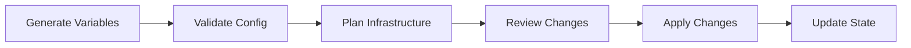

# Infrastructure Standards

> **Canonical reference:** [Infrastructure Standards (full)](https://azurelocal.cloud/standards/infrastructure/)  
> **Applies to:** All AzureLocal repositories  
> **Last Updated:** 2026-03-17

---

## Overview

Standards for Infrastructure as Code (IaC), Terraform state management, and deployment processes for the AVD on Azure Local solution.

---

## Infrastructure Pipeline

---

## State Management

| Principle | Rule |
|-----------|------|
| Remote state | Store Terraform state in Azure Storage Account |
| State locking | Enable locking during all operations |
| Backup | Regular state file backups before destructive operations |
| Naming | `avd-<env>.tfstate` (e.g., `avd-prod.tfstate`) |

---

## IaC Tool Parity

All tools must produce **identical infrastructure** when given the same configuration values:

| Tool | Primary Format | State Management |
|------|---------------|-----------------|
| Terraform | `.tf` / `.tfvars` | Remote state in Azure Storage |
| Bicep | `.bicep` / `.bicepparam` | ARM deployment history |
| ARM | `.json` | ARM deployment history |
| PowerShell | `.ps1` | Config-driven, logged |
| Ansible | `.yml` | Inventory-based |

---

## AVD-Specific Infrastructure

| Convention | Rule |
|-----------|------|
| Primary IaC tool | Terraform |
| Config source | `config/variables.yml` (single source of truth) |
| Parameter derivation | All tool-specific param files derived from central config |

### Deployment Phases

| Phase | Scope | Tools |
|-------|-------|-------|
| Phase 1: Azure Foundation | Host pools, workspaces, app groups, networking | Terraform, Bicep, ARM |
| Phase 2: Session Hosts | VM provisioning, domain join | Terraform, PowerShell |
| Phase 3: Configuration | FSLogix profiles, GPOs, scaling plans | PowerShell, Ansible |

---

## Related Standards

- [Infrastructure Generation & Deployment Process](https://azurelocal.cloud/standards/infrastructure/infrastructure-generation-deployment-process)
- [State Management](https://azurelocal.cloud/standards/infrastructure/state-management)
- [Solution Development Standard](solutions.md)
- [Variable Standards](variables.md)
- [Automation Interoperability](automation.md)
